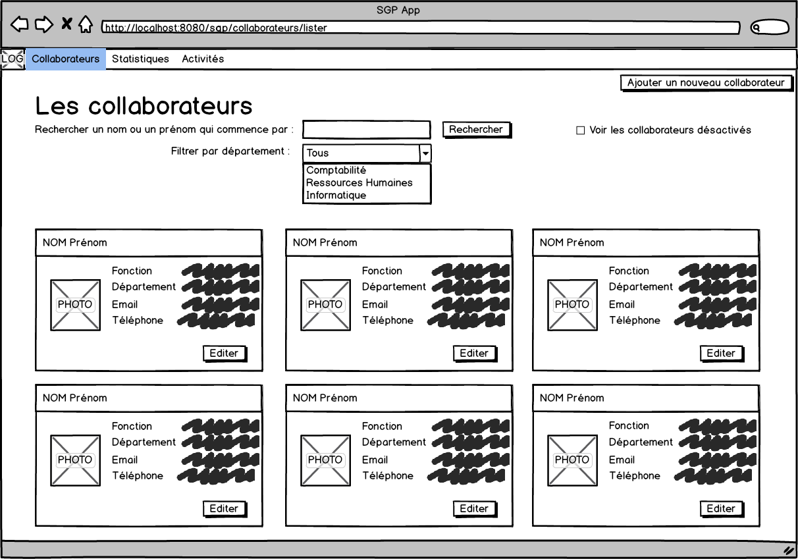
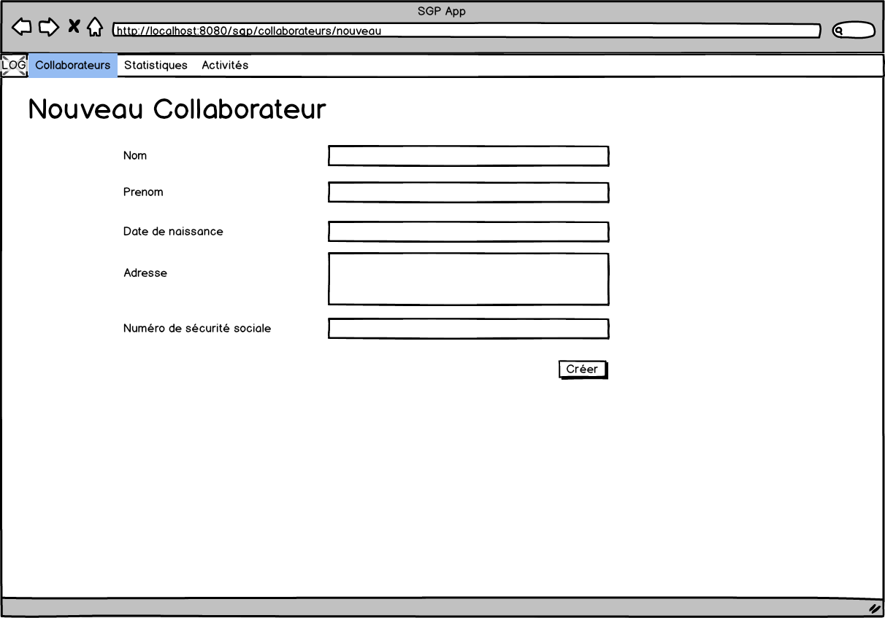
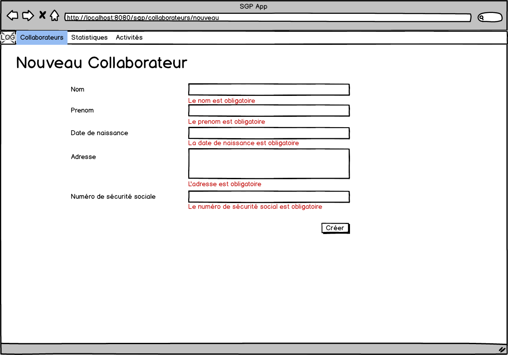
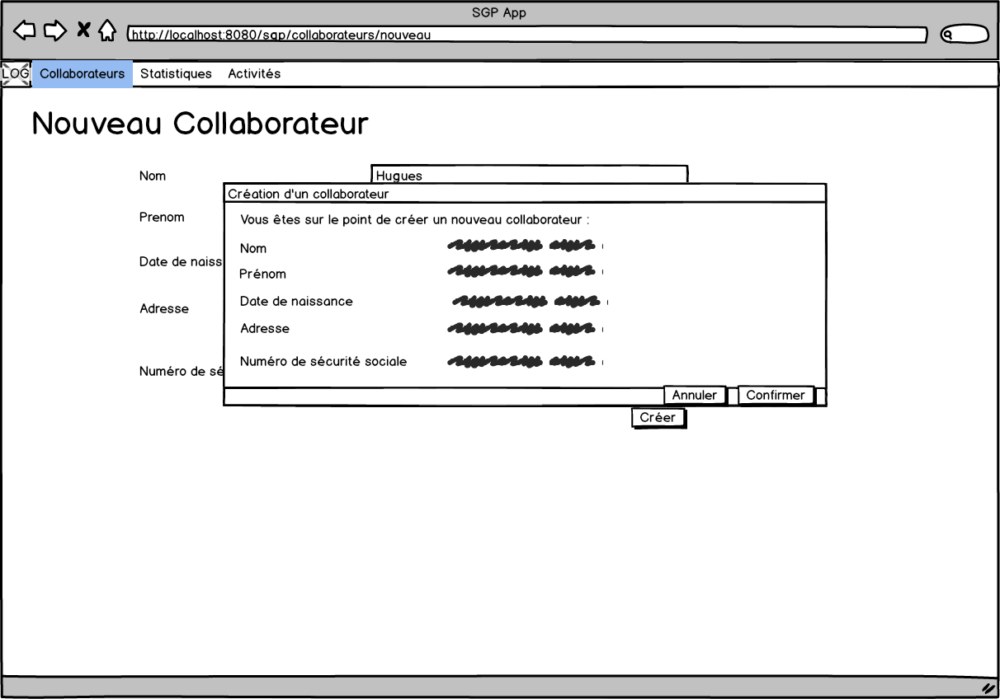
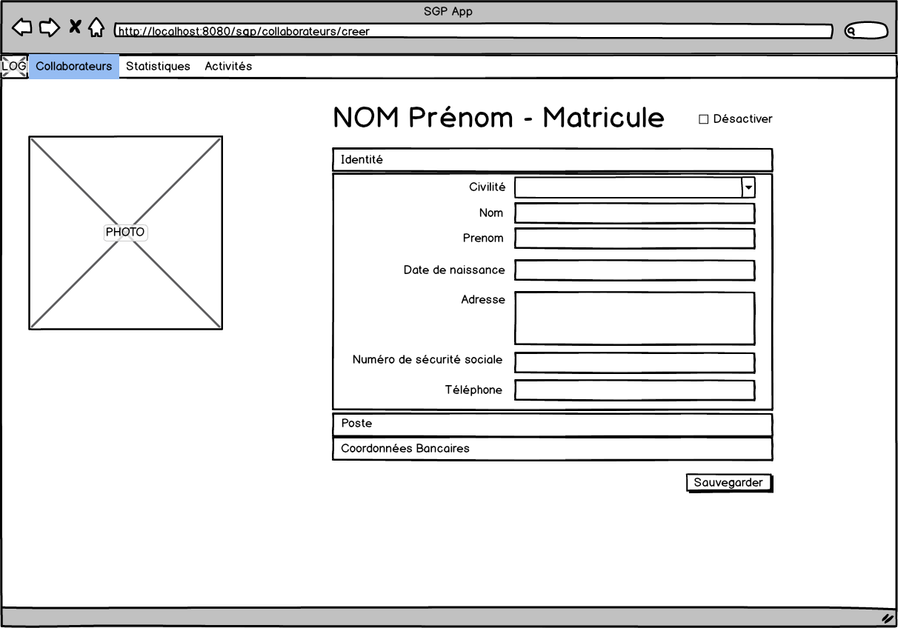
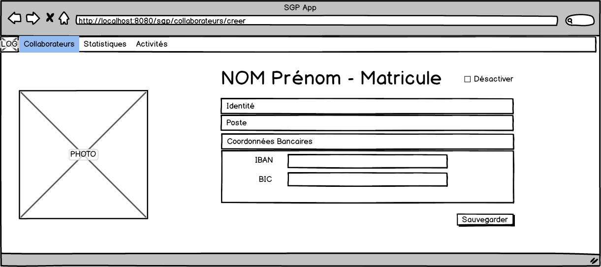
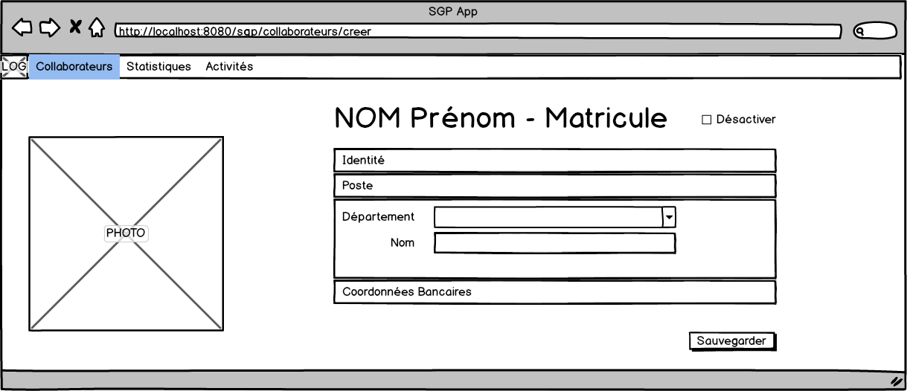
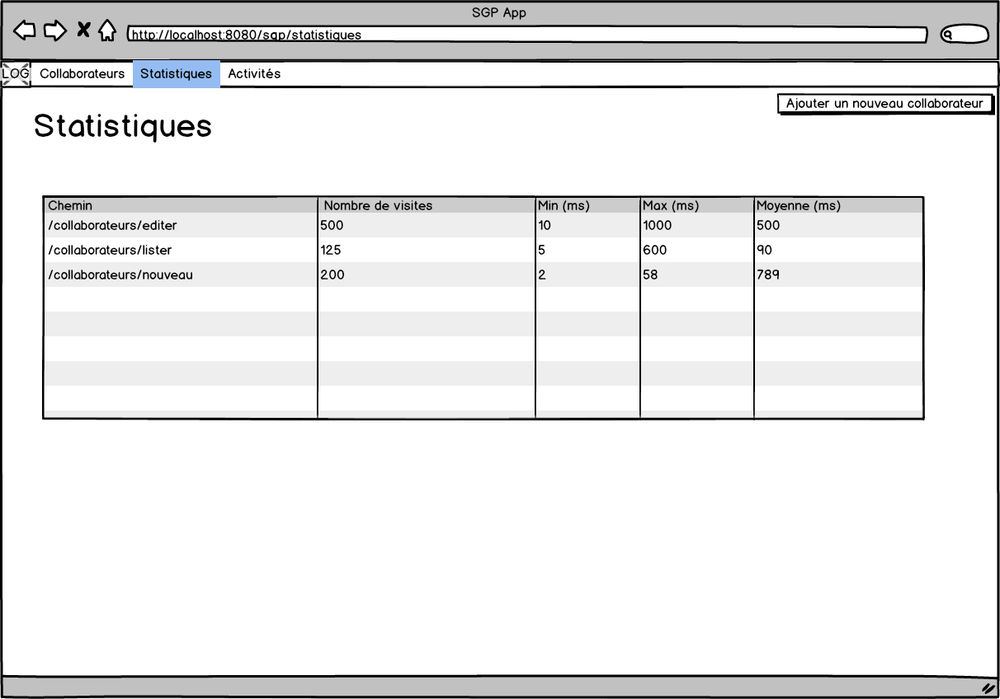
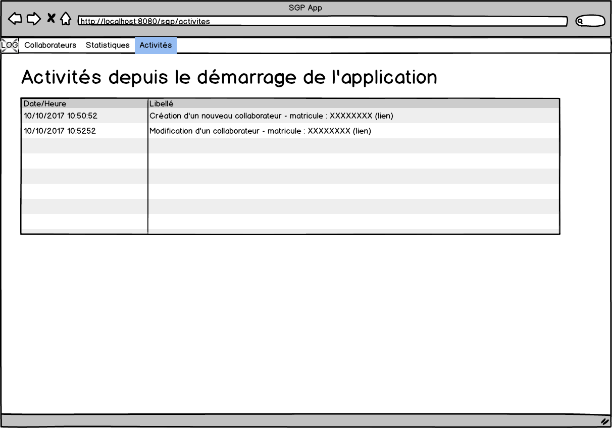

= Atelier Twitter Bootstrap

L'objectif de cet atelier est de construire les écrans d'une application de gestion du personnel.

L'atelier est conçu en ensemble d'itérations : 1 itération par fonctionnalité.

Nous allons travailler ensemble sur un dépôt Git.

== Itération 1 - Liste des collaborateurs

La page d'accueil de l'application présente la liste des collaborateurs.

Indications::
* Créer un fichier _index.html_.
* Les données sont pour cette première itération sont pour le moment en "dur".
Il s'agit surtout d'une maquette à ce stade.
* Les boutons ne font aucune action. Ils sont tous désactivés.
* Pour les écrans de petites tailles, le menu se replie.

== Itération 2 - Créer un collaborateur

Créer un formulaire de création d'un collaborateur.

Indications::
* Créer un fichier _creer-collab.html_.
* L'url _/creer-collab.html?errors_ affiche la version avec les messages d'erreurs.
* Le bouton _Ajouter un nouveau collaborateur_ de la liste des collaborateurs conduit à la page _/creer-collab.html_.
* Le bouton _Créer_ permet d'afficher une fenêtre modale de confirmation.

== Itération 3 - Editer un collaborateur

Créer un formulaire d'édition d'un collaborateur.

Indications::
* Créer un fichier _editer-collab.html_.
* L'url _/editer-collab.html?errors_ affiche la version avec les messages d'erreurs.
* Le bouton _Editer_ de la liste des collaborateurs conduit à la page _/editer-collab.html_.

== Itération 4 - Page statistiques

Créer une page d'affichage des statistiques.

== Itération 5 - Page activités

Créer une page d'affichage des nouveautés.

== Itération 6 - Créer avec données

Page de création d'un collaborateur::
* réfléchir à la manière dont seront stockés les collaborateurs dans un système de stockage.
* après validation de la confirmation, un objet collaborateur est inséré dans le système de stockage.

Concernant le système de stockage, pour cet exercice, vous avez le choix entre::
* un stockage centralisé géré par vous (PHP + base de données)
* un stockage local au navigateur (JavaScript)
* un stockage via un service en ligne comme Firebase (JavaScript)

== Itération 7 - Lister avec données

Page liste de collaborateurs::
* les collaborateurs affichés sont issus du système de stockage.

== Itération 8 - Editer avec données

Page éditer un collaborateur::
* les informations affichées sont issues du système de stockage.
* après validation le collaborateur est mis à jour dans le système de stockage.

== Itération  9 - Activités

Alimenter la page des activités à partir des données stockées dans le système de stockage.

== Itération 10 - Statistiques

A chaque visite du site, l'information est stockée dans le système de stockage.

La page de visualisation des statistiques est construite à partir des données stockées.

Les données (min, max et moyenne) sont calculées à partir des temps passés par l'utilisateur sur la page.

